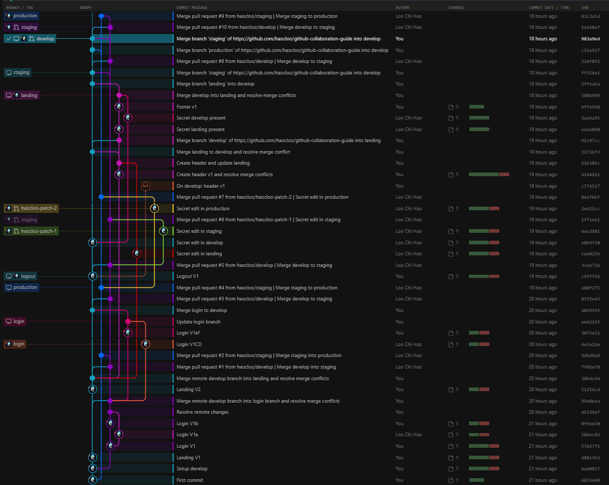

### This repo was made to equip the CS Society 23/24 technical team with the necessary skills to collaborate using Git and GitHub. You will learn how to set up your local and remote repositories, create branches, make commits, push changes, pull updates, merge conflicts, and more.

  

    <button style="background-color: #4CAF50; padding: 12px 20px; margin-top:15px; border: none; border-radius: 4px; font-weight:bold; cursor: pointer;">
        <a href="https://drive.google.com/uc?id=1WwWhkSG5piA-SpDGVzJLc2CDnLHHU2CH&export=download" style="color: white; text-decoration: none;">Download PDF Guideline</a>
    </button>

  

    <button style="background-color: #ff0000; padding: 12px 20px; margin-top:15px; border: none; border-radius: 4px; font-weight:bold; cursor: pointer;">
        <a href="https://youtu.be/Q3LvZW0UQq0?si=9u5QhHJZX5rfSIj2" style="color: white; text-decoration: none;">Watch on Youtube</a>
    </button>

  

> **Try out the Gitlens extension on this repo to visualize the commits on the commit graph.** 

